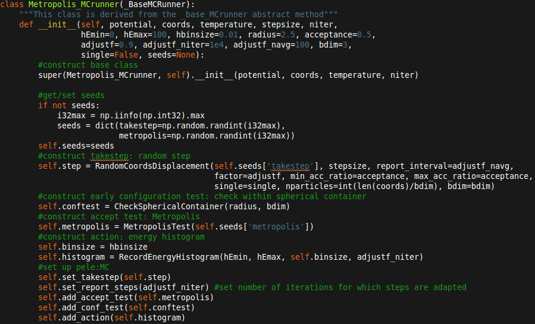
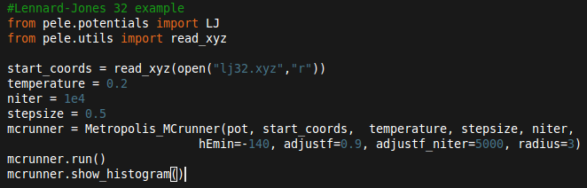

.. image:: https://travis-ci.org/pele-python/mcpele.svg?branch=master
    :target: https://travis-ci.org/pele-python/mcpele

.. image:: https://coveralls.io/repos/pele-python/mcpele/badge.png?branch=master 
    :target: https://coveralls.io/r/pele-python/mcpele?branch=master

mcpele : Monte Carlo Python Energy Landscape Explorer
+++++++++++++++++++++++++++++++++++++++++++++++++++++

Flexible and efficient Monte Carlo general purpose framework 
and MPI/mpi4py based Replica Exchange Method, built on the `pele <https://github.com/pele-python/pele>`_ 
foundations. mcpele provides a seamless integration of the
tools for energy landscape exploration built in pele. 
The package also acts as a plugin for the `Nested Sampling  <https://github.com/js850/nested_sampling>`_ project.

Through its c++ interface, mcpele makes Monte Carlo simulations available to 
researchers with little programming experience, without having to compromise
on efficiency. Furthermore mcpele abstracts each element of a Monte Carlo 
simulation eliminating the need for frequent code rewriting that experienced 
Monte Carlo developers typically go through, thus reducing the time required for
the implementation of an idea and reducing the occurrence of bugs.

Source code: https://github.com/pele-python/mcpele

Documentation: http://pele-python.github.io/mcpele/

.. figure:: diagram_fluid.png

  Figure 1: Diagramatic representation of the mcpele framework. On the right
  is a hard spheres fluid equilibrated by uniform sampling in a cubic box with
  periodic boundary conditions.

mcpele is authored by Stefano Martiniani, Ken J Schrenk and Jacob Stevenson at the University of Cambridge.
The project is publicly available under the GNU general public licence.

Description
===========
mcpele is a general purpose framework for Monte Carlo simulations that integrates
the c/c++ backend of the `pele`_ project through a python interface, including a number 
of potential energy functions, cell lists for n-dimensional spaces with and without 
periodic boundary conditions, tools for energy minimization and structure alignment.

Because mcpele is designed for large distributed parallel equilibrium simulations, it
provides a MPI/mpi4py implementation of the Replica Exchange Method known as Parallel
Tempering. 

Furthermore the library can act as a plug-in for the `Nested Sampling`_ project,
since Monte Carlo walks need to be run at each iteration.

All of mcpele runs in its c++ backend but the Monte Carlo routines are assembled
through its Python interface. The basic abstract structure of mcpele is summarised 
by the diagram in figure 1 (refer to `Get started`_ for details). 
The following methods are already implemented in mcpele: 

- **TakeStep**:
    - *RandomCoordsDisplacement*: Uniform random coordinates displacement (single particle and global)
    - *GaussianCoordsDisplacement*: Gaussian random coordinates displacement (single particle and global)
    - *ParticlePairSwap*: swap pairs of particles
    - *TakeStepPattern*: combines multiple moves and executes them deterministically with some frequency
    - *TakeStepProbabilities*: combines multiple moves and executes them probabilistically with some frequency
- **ConfTest**:
    - *CheckSphericalContainer*: checks that each particle is within some radius from the origin
- **AcceptTest**:
    - *MetropolisTest*: metropolis acceptance criterion
    - *EnergyWindowTest*: accept if energy is within some window
- **Action**:
    - *RecordEnergyHistogram*: stores entries in a resizable histogram and computes the moments of the distribution on the fly
    - *RecordPairDistHistogram*: records radial distribution function (accumulates each configuration into the same `g(r)` histogram)
    - *RecordEnergyTimeSeries*: records a time series of the energy
    - *RecordLowestEValueTimeSeries*: records a time series of the lowest eigenvalue from inherent structure
    - *RecordDisplacementPerParticleTimeSeries*: records mean square displacement for each particle

Get started 
===========

Build your first MC runner class
--------------------------------

The diagramatic representation in figure 1 summarises the abstract structure of mcpele. 
In mcpele we call a MCrunner those classes that can perform a Monte Carlo random walk.
Each MCrunner derives from the abstract class _baseMCrunner that implements the basic
abstract structure needed by every MCrunner, this takes by default a potential, initial coordinates,
temperature (or equivalent control parameter) and the target number of iterations. Once the parent class is constructed all
we need to do is to add to our new MCrunner class all the other components in the diagram
of figure 1 that are missing. 

Let us assume that we would like to build a MCrunner to simulate
particles with only translational degrees of freedom, such as Lennard-Jones atoms.
First we would like to add a TakeStep method to our MCrunner to displace the coordinates
of the system at each step, as required. The most simple type of displacement would be a 
random one, hence we choose the *RandomCoordsDisplacement* method that can perform both
single particle and global moves. 

Then we would like our system to be within a spherical
container, for instance to stop it from evaporating, and we add a configuration test,
*CheckSphericalContainer*. Note that we distinguish between *early* and *late* configuration
tests. Tipically configurations tests are cheaper than a potential energy call, hence we would
like to run them before the *compute energy* step; sometimes, however, configuration
tests can be more expensive than a potential call, hence we would rather run the test
after the *accept tests*.

The *accept tests* verify that the energy of the system after each step satisfies certain
constraints. In this case we choose the *MetropolisTest* acceptance criterion. Finally
we might want to record somme information during the run to compute some properties of
the system. One common choice is to record a energy histogram and its associated moments
(mean energy and variance). To do so we construct a *RecordEnergyHistogram* method.

Finally we need to plug each of the constructed methods into the MCrunner and we do so
by *adding* them. Note that after each iteration the loop *reports* back to the TakeStep
routines to, for instance, adapt the stepsize. Since adaptive steps break the 
detailed balanance of the random walk we might want to reach some target acceptance within
the first *adjustf_niter* steps and then keep the stepsize fixed and start recording
the histogram. Hence we *set_report_steps* to indicate the number of steps for which
the stepsize should be adapted.

In the present example we only used one method for each element of a generic MCrunner, however
one can combine multiple ones. *AcceptTests*, *ConfTests* and *Actions* can be added at will, simply
*adding* them to the MCrunner in the desired order of execution (*order matters!*).
*TakeSteps* can be combined through a *TakeStepPattern* class in a deterministic or
a probabilistic sequence: at each iteration only one type of step is taken and *report*
acts only on that particular step. For instance one might want to combine particles
swaps with random translation but would like the swaps to occur only once every *1000* steps.
Finally potentials can be combined through the `CombinedPotential <https://github.com/pele-python/pele/blob/95995f8c1449fa6a0160e5f142337a1a0b8fc250/source/pele/combine_potentials.h>`_ class.

Run a Monte Carlo random walk
-----------------------------

We have built our first MCrunner, so let us try running it. All it takes is loading some
initial coordinates, constructing the potential we want to use, in this case the pele::Lennard-Jones
potential, and then set parameters such as temperature, number of iterations, initial stepsize and a 
few more keyword arguments. Then we call the *run()* function and we get c++ performance
from a few lines of a pure Python interface. Finally we might want to *show* or *dump* the histogram.  

INSTALLATION
============

Required packages
-----------------

for compilation:

1. c++ compiler (must support c++11, GCC > 4.6 or similar)

python packages:

1. numpy: 
     We use numpy everywhere for doing numerical work.

#. `pele`_:
    python energy landscape explorer for potential, minimizers etc.

#. matplotlib:
     For making plots (e.g. histogram, time series, rdf etc.)

#. mpi4py: 
     for replica exchange Monte Carlo
     
non-python packages:

1. cmake: optional
    to compile using cmake (much faster)

All the above packages can be installed via the python package manager pip (or
easy_install), with the exception of pele.  However, some of the packages (numpy, scipy) 
have additional dependencies and it can be more convenient to use the linux package manager
(apt, yum, ...).

Tests
=====
mcpele has a suite of unit tests.  They can be run using the nose testing
framework (which can be installed using pip).  The tests are run from the top
directory with this command::

  nosetests mcpele
